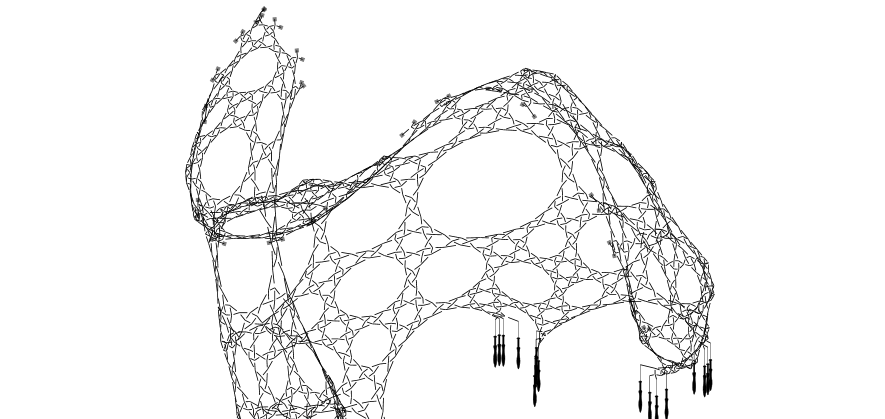
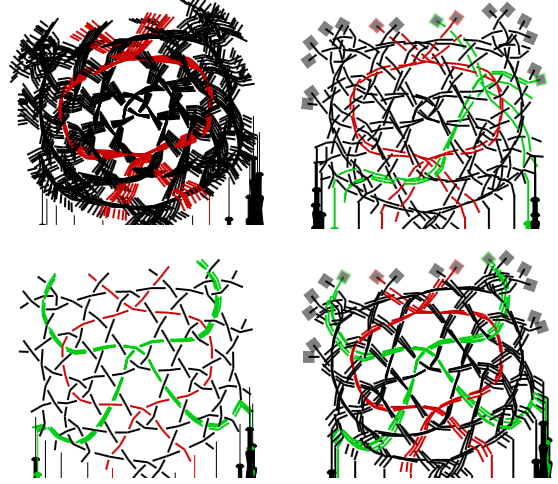

Bloopers
========

To err is human, for a real mess you need a computer.

1
-

[docs/show-graph.js]: https://github.com/d-bl/GroundForge/blob/52459fe36c69cf9dcf869148c8321577e6f3dd1d/docs/js/show-graph.js#L178-L180
[Download](https://github.com/d-bl/GroundForge/archive/52459fe36c69cf9dcf869148c8321577e6f3dd1d.zip),
extend the forces in [docs/show-graph.js] with something like

    .force("collide", d3.forceCollide(10).strength(10).iterations(30))
 
 and try `docs/index.html`.

2
-

Same [download](https://github.com/d-bl/GroundForge/archive/52459fe36c69cf9dcf869148c8321577e6f3dd1d.zip),
try repeated twists for the first thread diagram in the page `docs/recursive.html` then show the second thread diagram.

3
-

Not really a blooper, but a delicate balance between pattern, forces and interaction such as zooming during animation.

4
-

Try to drag or paint threads with Internet Explorer version 11.
On the left with [download](https://github.com/d-bl/GroundForge/archive/f0e832e.zip) on the right with the next.
